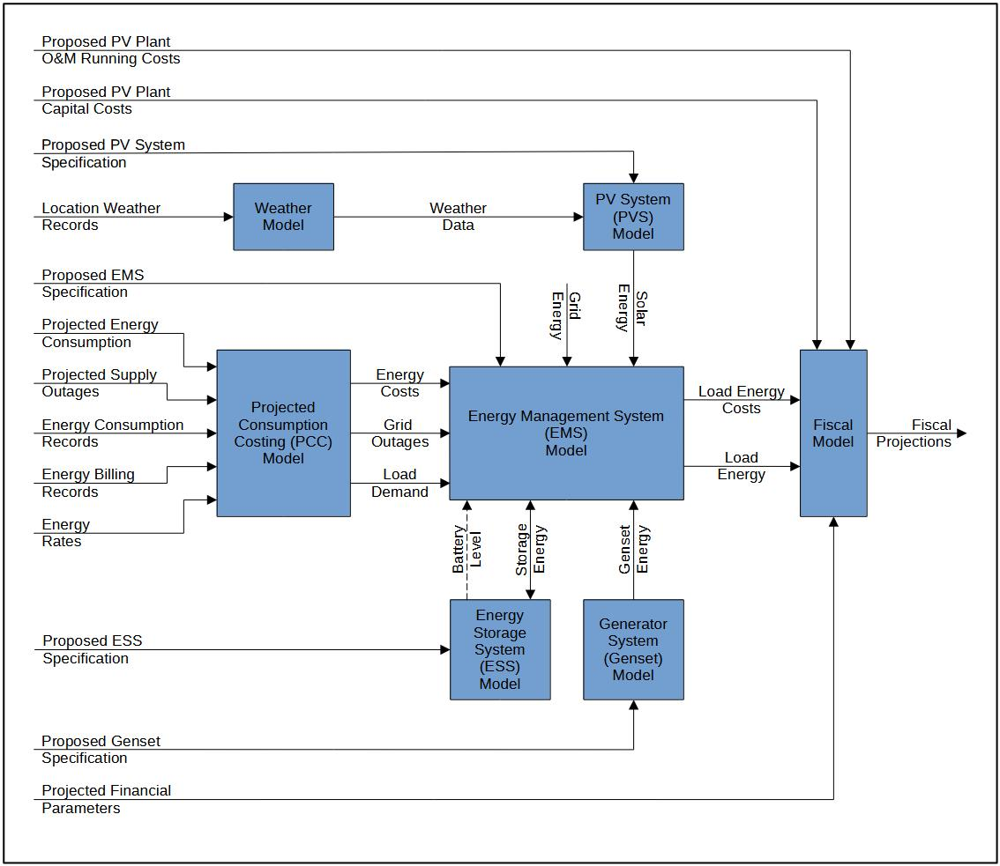

.. title:: PVPlant | System Overview

.. include:: globals.inc

.. _system_overview:

###############
System Overview
###############

The PV Plant Tool system overview is illustrated in :numref:`fig_pvplant_tool_scope`.

   PV Plant Tool Scope

The PVPlant tools accepts information as inputs that is processed through models creating
intermediate data, which in turn is processed through other models to ultimately arrive at Fiscal
Projections, the resulting output data.

Weather Model
=============

The weather model accepts location weather records which are available from various sources, and 
produces time-series Weather Data profile that is processed by the PV System Model can process.

Projected Consumption Costing Model
===================================

A forward-looking Load Demand profile for the following year is generated from historical energy
consumption records coupled with anticipated consumption changes specified in Projected Energy
Consumption.

A prediction of anticipated load-shedding is translated into a Grid Outage profile for the following
 year

Historical billing records, together with current Energy Rates and anticipated changes are used
to generate an Energy Cost profile for the following year

The Load Demand, Grid Outage and Energy Cost profiles are inputs to the :term:`EMS` Model

The PCC model projection range is typically a fiscal year.  Energy consumption and costs include
both electricity and fossil fuel.

PV System Model
===============

The PV system model uses a Weather Data profile to predicts solar energy output of a PV system.  The
generated Solar Energy profile is an input to the :term:`EMS` Model. 

This model characterises the interaction and performance of all the components in a PV Systems 
taking into account their efficiencies and losses.

Genset Model
============

The Genset specification is used by the Genset Model to generate a Genset Energy Profile useful to 
the :term:`EMS` Model.  

This profile associates fuel consumption with energy production, characterising the efficiencies and 
losses of the Genset. 

Energy Storage System Model
===========================

The Energy Storage System (ESS) Model characterises the charging and discharging capacity, rates 
efficiencies, losses of a the energy storage device (typically batteries), together with the 
components that transform energy to and from the form compatible with the storage device.

An ESS can be charging, discharging or static.  It cannot be both charging or discharging.

This Model iterates in lockstep with the EMS model.  For each time step iteration, the EMS Model
senses the Battery level, which it factors into its calculations to decide how much Storage Energy
to take from or give to the ESS Model.  The ESS Model computes the Charge Energy that actually gets
stored or drawn and adjusts the battery level accordingly for the next lockstep iteration.

Energy Management System Model
==============================

The Energy Management System (EMS) Model iterates over every time interval.  From the inputs
for every time interval, based on energy cost and availability for that time, it computes the 
amount of energy to take from each energy source to satisfy Load Demand, charge batteries or
export back to the grid.

This way the EMS manages power from the Genset when there are extensive outages, holds sufficient 
ESS charge to carry over load-shedding outages, and sufficient ESS charge to supplement Load Demand
peaks. All the while maximising Solar energy utilisation as much as possible.  How the EMS 
manages this is governed by the parameters in the EMS specification.

The EMS Model produces a Load Energy profile.  This profile contains the amount of energy drawn from
or exported to each Energy source.  Accompanying this profile is a Load Energy Cost profile.  These
two profiles are useful to the Fiscal Model.  These profiles cover the first full year of PV Plant
operation.

Fiscal Model
============

The Fiscal model uses the Load Energy and associated costs to calculate a time-series cost of energy
production.  This information is compared with the cost of Load Demand supplied totally from grid
and existing genset, or estimated costs associated with outages.  This information is further 
processed against PV Plant CapEx and OpEx, and projected financial parameters to produce a 
cost and saving financial profile for the first year of operation.

Then with financial projections such as inflation rate, interest rates, energy supply cost 
escalations, component deterioration, etc. the annual numbers are projected for the lifetime of 
the PV Plant, from which finanicial management information is distilled which is useful in assessing
the viability and return on investing in a the PV Plant.
cost
