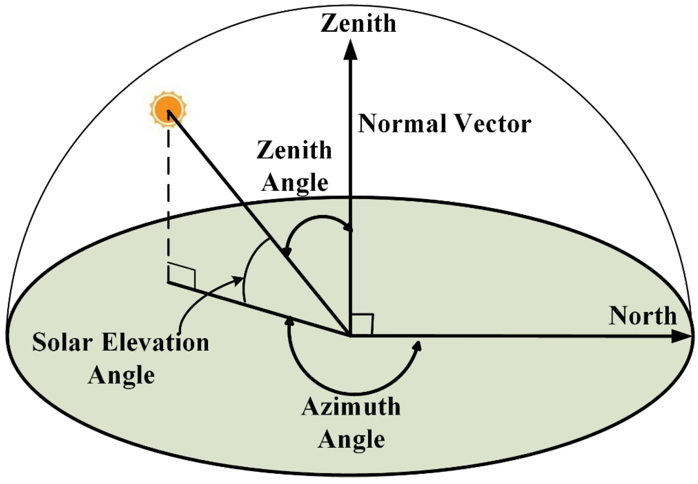
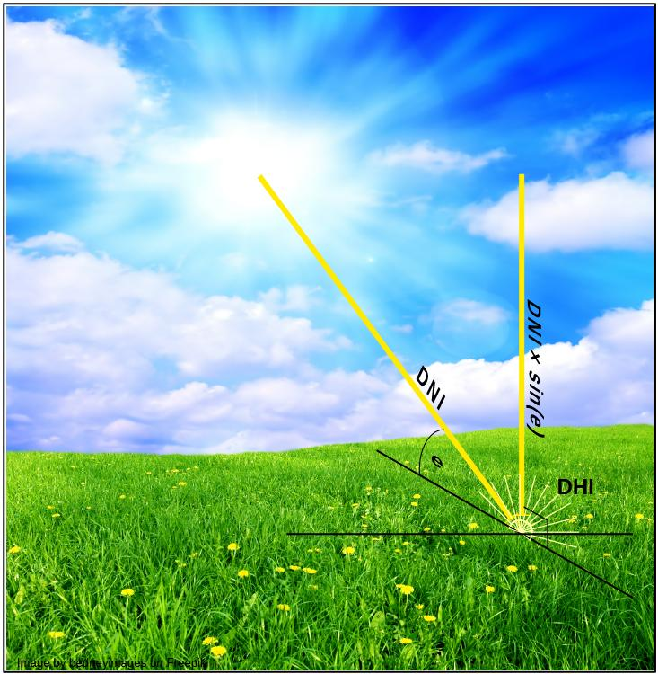
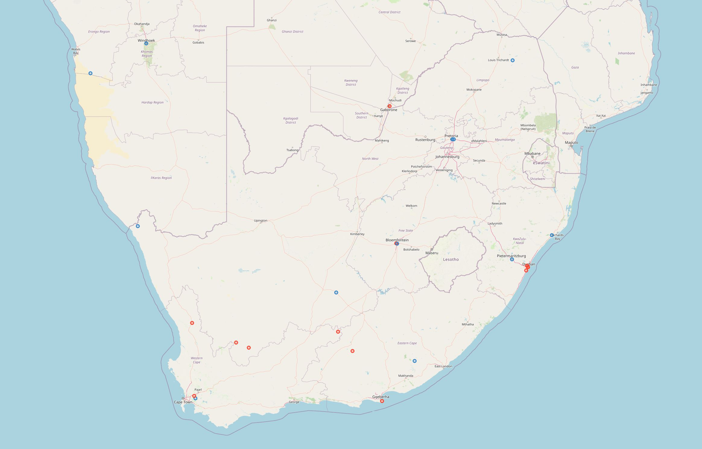
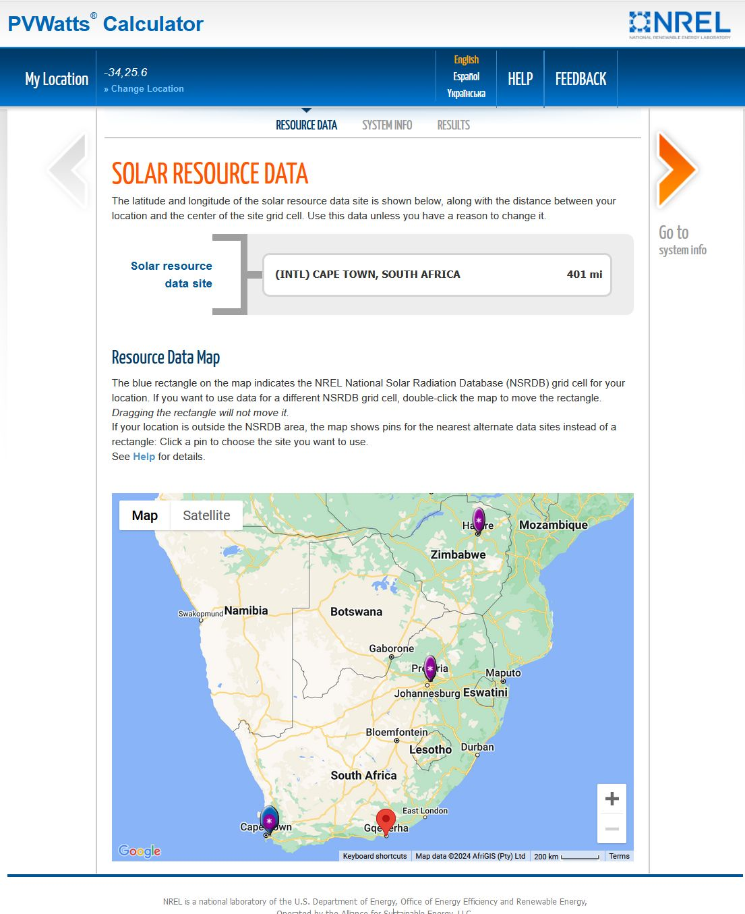

.. title:: PVPlant | Input Information | Weather Data

.. include:: ..\globals.inc

.. _weather_records:

============
Weather Data
============

It does matter what and whose weather data is used to predict PV Plant power output.  Weather Data 
is not all created equally.  Simply pick a location, obtain different types weather data from one 
or more sources, and sum or average the annual :term:`Insolation`.  Often the variation is more than
20%.  This variation is huge in an analysis where fractions of a percentage point count.

I do not believe it is good enough to rely on the default weather record source of your favourite 
tool to predict PV Plant production, without understanding how the weather data was created and its
limitations.  It is tempting to hide behind the reputation of your favourite PV Plant modelling 
tool, but, will that help you explain to your customer why the plant is not producing what was
predicted?

About Weather Data
==================

Weather Data of interest to PVPlant is time-series Irradiance, wind speed, ambient temperature, and 
sun position.  The Irradiance is made up of :ref:`dni_dhi_ghi`.  The Sun's position is specified by 
its :ref:`azimuth and apparent elevation <sun_pos>`.

Weather Data selection is far more complex than one would think.  Let's proceed down a short rabbit
hole of the complexities, or skip to :numref:`weather_data_conc`.
PVPlant.

.. _sun_pos:

Position of the Sun
-------------------

The sun's position from any point on the surface on earth is specified by its azimuth and apparent
elevation.  

   Solar Position - Azimuth and Elevation

Elevation is angle that the sun's rays make with the horizontal surface of the earth.
The suns rays bend progressively by a small amount the closer the sun is to the horizon, due to the
increased distance rays travel through the earth's atmosphere.  The apparent elevation value 
accounts for the slight refraction through the earth's atmosphere.

Azimuth is the horizontal surface angle clockwise from North to the horizontal component of the 
Sun's elevation
 
.. _dni_dhi_ghI:

DNI, DHI and GHI
----------------

Irradiance is the instantaneous power (W/m\ :sup:`2`)from the sun on a (horizontal) surface 
1 m\ :sup:`2`.  Insolation is the accumulation of radiant power on this surface over the period of
an hour.  (Wh/m\ :sup:`2`).  Irradiance is to power what Insolation is to Energy.

   Irradiance - DNI and DHI

The important Irradiance Data numbers are:

*  **DNI**:  Direct Normal Irradiance is the direct ray of light emanating from the sun on a surface
   perpendicular to the sun, 1 m\ :sup:`2`
*  **DHI**:  Diffuse Horizontal Irradiance is the sun's irradiant power that is scattered by 
   aerosols in the atmosphere.  DHI is present at all angles and appears equally on a 1 m\ :sup:`2`
   surface at any orientation, tilt and slope.
*  **GHI**:  Global Horizontal Irradiance is all the radiant light falling on a horizontal surface
   1 m\ :sup:`2`.  It is the sum of the vertical component of DNI and DHI.

   .. math:: GHI = DNI \times sin(e) + DHI
      :label: GHI
      
   where *e* is the apparent elevation angle of the sun.
   
Capacity Factor
---------------

Capacity Factor is a useful metric in assessing the power production performance.  It is the 
ratio of actual or predicted annual power production of a PV Plant to it's name-plate power 
production.

For example, say a Plant has 100 |ndash| 550Wp modules, and according to a power production 
prediction calculation, has an annual energy production of 90MWh.  The capacity factor is calculated
as:

.. math:: 
   :label: NPE
   
   \begin{align}Annual\ Name\ Plate\ Energy &= Number\ of\ Modules \times Module\ Power \times  hours\ in\ year\\
   \\
   &= 100 \times 550\ Wp \times 8\ 760\ h\\
   \\
   &= 481.8\ MWph\end{align}
   
.. math::
   :label: CF
   
   \begin{align}Capacity\ Factor &= \frac{Annual\ Energy\ Production}{Annual\ Name\ Plate\ Energy}\\
   \\
   &= \frac{90\ MWh}{481.8\ MWph}\\
   \\
   &= 18.68 \% \end{align}
   
Typical real world Capacity Factor percentages range between 10 and 25 percent. 

Any location on earth has theoretical Maximum Capacity Factor depending on its weather. It is 
calculated as follows:  

.. math::
   :label: MCF
   
   Maximum\ Capacity\ Factor = \frac{Annual\ Insolation\ (Wph/m^2)}{(1\ 000\ (Wp/m^2) \times hours\ in\ year)}

For example, say a location experiences an Annual Insolation of 2MW/m\ :sup:`2`.

.. math::
   :label: MCF1
   
   \begin{align}Maximum\ Capacity\ Factor &= \frac{2\ 000\ 000\ Wp/m^2}{1\ 000\ Wph/m^2 \times 8\ 760\ h}\\
   \\
   &= 22.83 \% \end{align}

Weather Data Providers and Sources
----------------------------------

In the spirit of open information and public availability, Weather Data from like-minded
organisations are considered.  The Weather Data organisations considered here are NREL, PVGIS, and 
CAMS

:cite:`pvlib_wd_twds` and :cite:`pvlib_iotools` lists three types of weather sources:

Ground Weather Stations
+++++++++++++++++++++++

Ground Weather Stations take actual irradiance weather measurements at specific geographic
locations.  When the measuring equipment is high quality, calibrated and operating correctly, 
these weather stations log the most accurate information for that location.  However, equipment
needs periodic calibration and maintenance and does go faulty from time to time leaving holes in
the accurate information.  Some ground stations make their weather data publicly available.

Because of the large expense of maintaining high quality weather stations they are rather scarce.  
At the time of this writing :cite:`solstns` identifies only 10 active sites in the whole of 
South africa as shown in :numref:`fig_solstns`.  The blue dots represent active sites, the red dots,
inactive sites. 

   Solar Ground Weather Stations
   
Unless the PV Plant being proposed is close to one of these sites, this data is not really an option
for PVPlant.

A purpose of these ground station measurements is to verify the computation of Irradiance Data 
modelled from satellite data.

Satellite Data
++++++++++++++

There are a number of research and commercial entities that analyse data from weather satellites
observing cloud cover and air :term:`turbidity`, which is then processed through their irradiance
and atmospheric models, producing reasonably accurate irradiance estimates.  These model 
estimates are improved from time to time by comparing them with ground station measured results.

Satellite data has uniform spatial resolution in the satellite's geographical coverage,
typically 0.05\ |deg| latitude |mult| 0.05\ |deg| longitude (\ |asymp| 5 km |mult| 5 km). Some 
Data providers even provide interpolated values to the exact location.

The temporal resolution of satellite data is also very good, typically sub hour.  There are no holes
or periods of uncalibrated data like one finds in measured data.

Reasonable accuracy together with high spatial and temporal resolutions make satellite data
attractive for PV Plant power production predictions.

Reanalysed Data
+++++++++++++++

Reanalysed data increases geographical coverage by deriving irradiance estimates from weather
forecasting data.  The uncertainties of reanalysed data is much higher than satellite data, making 
it the option to only use for locations without satellite data.  Spacial resolutions are typically 
0.25\ |deg| latitude |mult| 0.25\ |deg| longitude (\ |asymp| 25 km |mult| 25 km).

Types of Weather Data
---------------------

Typical Meteorological Year (TMY) Data
++++++++++++++++++++++++++++++++++++++

The median data for a particular month is calculated from a data set, and the actual year whose 
monthly data is closest to the calculated median is taken as the Typical Meteorological Month for 
the TMY.  Typically, weightings are given to certain data items in determining the median month.

The approach is the same but different data set providers implement the details differently.

`NREL <https://www.nrel.gov>`_ describe their data sources and how they calculate TMY data in 
:cite:`nrel_tmy3` and :cite:`nrel_tmy_ds`.  NREL TMY data is based on ground observations, and 
in the whole of Southern africa data is either observed in Harare, Johannesburg or Capetown.  The 
site requires latitude and longitude coordinate entry and then shows how far this site is from the 
closest dataset.

   PV Watts Data Source Selection

`PVGIS <https://joint-research-centre.ec.europa.eu/photovoltaic-geographical-information-system-pvgis_en>`_
describe their data sources and approach in :cite:`pvgis_tmy`, :cite:`pvgis_tmy_ds`, and 
:cite:`pvgis_man` PVGIS TMY data appears to be derived from satellite data, so the spacial accuracy 
is good.  Data is obtained from https://re.jrc.ec.europa.eu/pvg_tools/en/#TMY

I recall reading somewhere that the estimated uncertainty for TMY data is 3%, but I have not been 
able to find this reference again.  Any help is appreciated.

Multi-year Time-series Data
+++++++++++++++++++++++++++

Multi-year Time-series Data is calculated from satellite data.  

`NREL <https://www.nrel.gov>`_ obtains its time series information for South Africa from
Meteosat IODC, but only has records for 2017 to 2019, :cite:`nrel_ts_ds`.  A three-year span is 
insufficient to provide averages that can show the weather data pattern with sufficient certainty.

`PVGIS <https://joint-research-centre.ec.europa.eu/photovoltaic-geographical-information-system-pvgis_en>`_
provides time-series data gleaned from european geo-stationary weather satellites.  Instantaneous 
hourly data values for the years 2005 through 2020 are available in their PGIS-SARAH2 Database.  
Their download tool allows for panel slope and azimuth -- setting these value to zero downloads 
horizontal surface irradiance values, :cite:`pvgis_52`, :cite:`pvgis_hrly`, and :cite:`pvgis_hr_ds`.

`CAMS <https://ads.atmosphere.copernicus.eu/cdsapp#!/home>`_ :cite:`cams_docs`, :cite:`cams_ug` only
provides time series data to 1 minute temporal resolution, interpolated to location of interest from
2 January 2004 to present minus two days :cite:`cams_ts`.  It is possible to compute annual average 
time-series and TMY time series from these data-sets with reasonable uncertainties.

Theoretical Clearsky Model
++++++++++++++++++++++++++

Many tools abound for clearsky communication models.  PVPlant uses pvlib as the tool with the 
internal defaults  https://pvlib-python.readthedocs.io/en/stable/index.html

* NREL SPA - solar position, which also accounts for light refraction close to the horizon
* Ineichen and Perez clear sky model Clearsky model: Perez 
* Kasten and Young Air mass model.

CAMS Timeseries also has an option for providing clearsky data calculated from satellite imagery 
which is probably more accurate as information based on current observed data is likely to be more
accurate than modeled data based on historical data.  But, I have no way of verifying this.

Accuracy of Data
----------------

Ultimately, we are interested in the quality of the data selected, so we can predict PV Plant solar 
power performance accurately.

Irrespective of the type of weather data the more years the data covers the better.  Generally the
larger the sample set the lower the uncertainties, One would want to consider at least 10 years of
data as a minimum

TMY data wants to eliminate weather caused by unusual and randomly occurring events such as volcanic
eruptions, earthquakes, large fires, wars, and the like.  Averaging Times-series
data on the other hand will include a weighting of these events.  

There are proponents for the use of one type or another.  I personally believe averaged time-series
is more representative of reality.  Although there is no way of predicting when one of events occur
and what their effect on weather will be, we can be certain that weather affecting events will
continue to occur, and at the frequency they have occurred in the past.

As of this Writing, 
`PVSyst <https://www.pvsyst.com>`_ and `Helioscope <https://www.helioscope.com>`_ by default use 
`Meteonorm <https://www.meteonorm>`_ TMY weather data-sets.  Meteonorm obtains its TMY datasets from
NREL and `DWD <https://www.dwd.de>`_ - both only providing measured data at specific locations, 
making them less than ideal for analysis unless the PV plant is close to a measuring station.

`OpenSolar <https://www.opensolar.com>`_ uses NREL's `SAM <https://sam.nrel.gov/>`_ to model solar
performance.  SAM uses the NREL's TMY data too.  

Concerns about data set accuracy are real. :cite:`edbodmer_sra` and :cite:`pvsyst_data_accuracy`.
Accuracy analysis of PVGIS and CAMS, largely cover Europe, and show reasonable but not ideal
correlations with measured results. :cite:`cams_rad_consist`, :cite:`cams_rad_perf`, 
:cite:`pvgis_comp`

.. _weather_data_conc:

Concluding remarks
------------------

As of this writing I have not found any accuracy analyses of data sets for South Africa.  Predicting
production of a solar plant is an art, where predictions from data-sets are really a guide.  
Especially so in South Africa.
 
PVPlant supports the use of both TMY and Time-series data, with Clearsky data providing a useful
idealised reference.  

Personally, I favour averaged time-series data over TMY data.  If TMY data is required, use PVGIS's 
TMY information.  When it comes to Time Series, CAMS provides data that can be used without 
manipulation whereas PVGIS data requires some interpolation and conversion of irradiance numbers to
insolation. Also, there are more years available in the CAMS data set.

Because of the variability of data, a good approach may be to calculate annual solar production 
using PVGIS TMY, PVGIS time series and CAMS time series data, to judge where the actual plant
production may fall.
